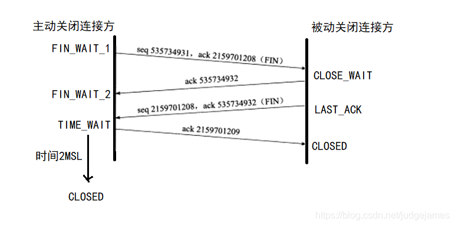

# 网络基础

## TCP首部报文格式（SYN、ACK、FIN、RST必须知道）

  RST：用于在TCP连接的过程和连接已经建立的情况下，立即终止连接。通常用于错误或异常的处理。
  ACK：用于确认接收方已经成功接收到发送方传输的数据
  FIN：用于在TCP连接中发起关闭连接的操作
  SYNC：用于TCP连接过程中，进行双方的同步和初始化连接的操作
  URG：用于告知接收方在数据包中存在需要优先处理的紧急数据
  PSH：用于指示发送方应立即将数据发送至接收方，而不是等填充满发送缓冲区再发送

## TCP三次握手及状态变化。为啥不是两次握手？

- 第一次握手（SYN）
- 客户端向服务器发送连接请求报文，其中设置SYN标志位为1，同时选择一个初始的序列号。
- 此时客户端处于SYN_SENT（同步已发送）状态，等待服务器确认。
- 第二次握手（SYN + ACK）
- 服务器接收到客户端的连接请求报文后，会回复一个确认报文。
- 在确认报文中，设置SYN标志位和ACK标志位均为1，同时选择一个自己的初始序列号。
- 此时服务器处于SYN_RCVD（同步已接收）状态。
- 第三次握手（ACK）
- 客户端收到服务器的确认报文后，会再次向服务器发送确认报文。
- 在确认报文中，设置ACK标志位为1，同时确认服务器的序列号。
- 此时客户端和服务器都进入ESTABLISHED（已建立连接）状态，TCP连接建立成功，双方可以开始进行数据传输。
  为啥不是两次握手：假如是两次握手，当客户端发出请求，如果网络延迟过大，客户端因超时关闭了连接，而服务端无法感知这种情况。

## TCP四次挥手及状态变化。为啥不是三次挥手？

为什么是4次挥手而不是三次：由于TCP是全双工的模式：客户端请求关闭后，还可以接收数据，也就是说服务端在收到FIN报文后，还可以将未发完的数据发给客户端。

<!-- 1、OSI7层网络模型：应用层、表示层、会话层、传输层、网络层、链路层、物理层
2、TCP/IP四层网络模型：应用层、传输层、网际层、接口层
综合OSI与TCP/IP模型，学习五层网络模型：
从上向下架构：应用层、传输层、网络层、链路层、物理层
3、MTU
4、MAC地址
网络层：
5、地址解析协议
ARP协议
6、为啥有IP地址还需要MAC地址？同理，为啥有了MAC地址还需要IP地址？
mac地址用于在局域网内输出数据，而ip地址用于帮助确定在全球互联网中的路由路径。
7、网络层转发数据报的流程
- 接收数据报：
  首先，网络层接收到数据报，这可能是来自上一跳路由器或主机的。数据报包含目标IP地址和其他相关信息。
- 检查目标地址：
  网络层检查数据报的目标IP地址，以确定应该将数据报转发到哪里。如果目标地址是本地地址（与接收方在同一子网），则数据报将直接发送到目标主机。
- 查找路由表：
  如果目标地址不是本地地址，网络层将查询路由表以确定下一跳路由器的地址。路由表可能包含静态路由条目，也可能包含动态路由信息（通过路由协议如OSPF或BGP学习到的路由信息）。
- 选择下一跳路由器：
  根据路由表中的信息，网络层选择下一跳路由器的地址。这通常是通过匹配目标地址和路由表条目中的网络前缀来确定的。
- 封装数据报：
  网络层将数据报封装在新的数据包中，这个数据包的目的地是下一跳路由器的IP地址。通常，这个新的数据包会包含数据报的整个副本，以及一些额外的信息，如TTL（生存时间）字段。
- 转发数据包：
  最后，网络层将封装好的数据包发送到下一跳路由器。这可能涉及到将数据包发送到与目标路由器相连的接口，并通过数据链路层协议（如以太网）将数据包传输到下一跳路由器。
- 重复过程：
  下一跳路由器接收到数据包后，会重复这个过程，直到数据包到达目标主机为止。
  8、子网划分、子网掩码
  9、网络控制报文协议ICMP
  10、ICMP应用举例：PING、traceroute
  传输层：
  11、TCP与UDP的区别及应用场景
  TCP适用于对数据传输可靠性要求较高的场景，而UDP适用于对实时性要求较高、延迟较低的场景
  12、
  13、TCP滑动窗口原理
  发送段的窗口表示还可以发送未确认的数据包个数，接收端的窗口表示当前可以接收的数据包个数。两者的差值就是可用的带宽。窗口的大小是可以动态调整的。
  14、TCP超时重传时间选择
  根据网络延迟和拥堵的情况动态选择超时重传的时间。
  15、TCP流量控制
  发送方根据接收方窗口的大小来判断其接收能力，根据其接收能力来调整发送窗口的大小
  16、TCP拥塞控制（一定要弄清楚与流量控制的区别）
  拥堵控制关注的是整个网络的负载情况，而流量控制关注的是某个TCP连接。

19、TCP连接释放中TIME_WAIT状态的作用
确保在连接关闭前完全传输
20、SYN泛洪攻击。如何解决？
IDPS
21、TCP粘包
连续几个小数据包合并成一个大数据包的现象。
22、TCP心跳包
用于保持TCP连接存活的技术
23、路由器与交换机的区别
24、UDP如何实现可靠传输 -->

# 网络编程

1、IO多路复用：select、poll、epoll的区别（非常重要，几乎必问，回答得越底层越好，要会使用）

2、手撕一个最简单的server端服务器（socket、bind、listen、accept这四个API一定要非常熟练）

3、线程池

4、基于事件驱动的reactor模式

5、边沿触发与水平触发的区别

6、非阻塞IO与阻塞IO区别

<!-- 参考书籍：《Unix网络编程》
ps:网络编程掌握以上几点就够了，要搞明白还是要花很久时间的。 -->

# http、https原理及实现

# 时间敏感网络TSN

## 时间同步
