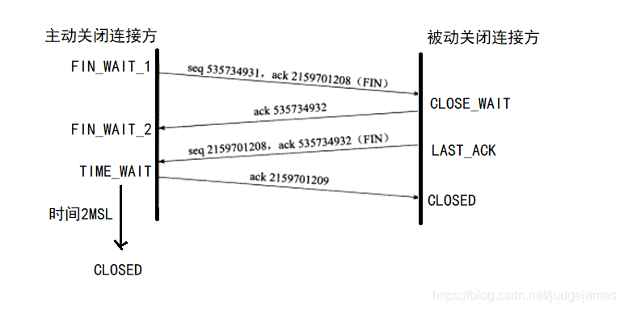

# 网络基础

## TCP首部报文格式（SYN、ACK、FIN、RST必须知道）

  RST：用于在TCP连接的过程和连接已经建立的情况下，立即终止连接。通常用于错误或异常的处理。
  ACK：用于确认接收方已经成功接收到发送方传输的数据
  FIN：用于在TCP连接中发起关闭连接的操作
  SYNC：用于TCP连接过程中，进行双方的同步和初始化连接的操作
  URG：用于告知接收方在数据包中存在需要优先处理的紧急数据
  PSH：用于指示发送方应立即将数据发送至接收方，而不是等填充满发送缓冲区再发送

## TCP三次握手及状态变化。为啥不是两次握手？

- 第一次握手（SYN）
- 客户端向服务器发送连接请求报文，其中设置SYN标志位为1，同时选择一个初始的序列号。
- 此时客户端处于SYN_SENT（同步已发送）状态，等待服务器确认。
- 第二次握手（SYN + ACK）
- 服务器接收到客户端的连接请求报文后，会回复一个确认报文。
- 在确认报文中，设置SYN标志位和ACK标志位均为1，同时选择一个自己的初始序列号。
- 此时服务器处于SYN_RCVD（同步已接收）状态。
- 第三次握手（ACK）
- 客户端收到服务器的确认报文后，会再次向服务器发送确认报文。
- 在确认报文中，设置ACK标志位为1，同时确认服务器的序列号。
- 此时客户端和服务器都进入ESTABLISHED（已建立连接）状态，TCP连接建立成功，双方可以开始进行数据传输。
  为啥不是两次握手：假如是两次握手，当客户端发出请求，如果网络延迟过大，客户端因超时关闭了连接，而服务端无法感知这种情况。

## TCP四次挥手及状态变化。为啥不是三次挥手？

为什么是4次挥手而不是三次：由于TCP是全双工的模式：客户端请求关闭后，还可以接收数据，也就是说服务端在收到FIN报文后，还可以将未发完的数据发给客户端。

UDP和TCP的区别
1、连接性：UDP是无连接的，TCP是有连接的
2、可靠性：TCP通过重传来保证数据传输的可靠性，UDP则没有这个机制
3、有序性：TCP通过序列化确保数据的顺序性，UDP则没有这个机制
4、数据传输方式：TCP采用字节流传输，UDP采用报文传输
5、TCP和UDP的传输速度：TCP的传输速度相对较慢，因为它需要进行三次握手、四次挥手、确认机制等。而UDP则没有这些机制，因此传输速度更快。

## unix套接字
unix套接字是一种用于进程间通信的机制，它可以在两个进程之间进行数据传输。它是一种基于文件系统的套接字，因此可以在不同的进程之间进行通信。

# 网络编程

1、IO多路复用：select、poll、epoll的区别（非常重要，几乎必问，回答得越底层越好，要会使用）
select(fd_set *readfds, fd_set *writefds, fd_set *exceptfds, struct timeval *timeout): 用位图，最多监控1024个文件描述符，返回就绪的文件描述符，每次都要遍历+拷贝位图，时间复杂度O(n)
poll(struct pollfd *fds, nfds_t nfds, int timeout)
用数组，取消了1024个文件描述符的限制，但是还是要遍历和拷贝，本质和select一样低效
epoll(int epfd, int op, struct epoll_event *ev)
epoll_wait(int epfd, struct epoll_event *events, int maxevents, int timeout)
用红黑树+就绪链表，只监听活跃的fd，无拷贝，不用遍历

2、手撕一个最简单的server端服务器（socket、bind、listen、accept这四个API一定要非常熟练）

3、线程池

4、基于事件驱动的reactor模式

5、边沿触发与水平触发的区别

6、非阻塞IO与阻塞IO区别

<!-- 参考书籍：《Unix网络编程》
ps:网络编程掌握以上几点就够了，要搞明白还是要花很久时间的。 -->

# http、https原理及实现

# 时间敏感网络TSN

## 时间同步
